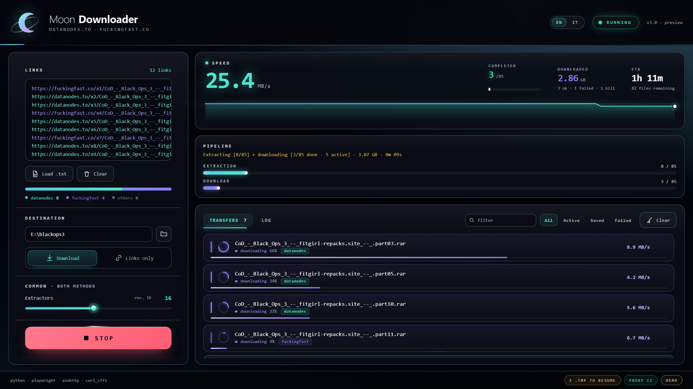
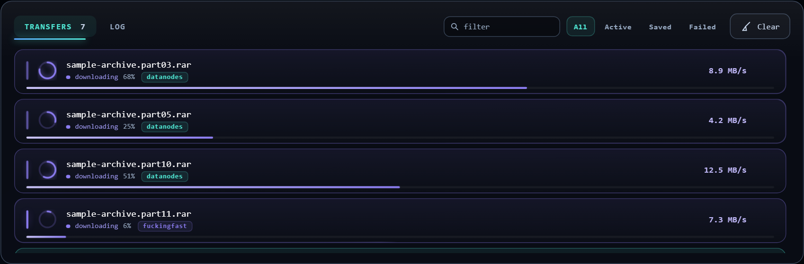
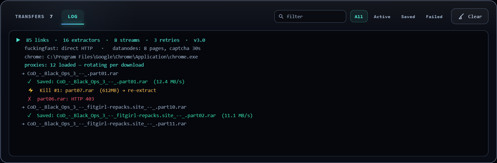

<div align="center">

# 🌙 Moon Downloader

### **V4.1**

**Bulk file downloader** — real-Chrome extraction for datanodes.to, pure-HTTP extraction for fuckingfast.co, aiohttp streaming, and a GUI that runs on Edge WebView2.

**Supported providers:** datanodes.to · fuckingfast.co

Built with Python · Playwright · aiohttp · curl_cffi

[](https://python.org)
[](https://playwright.dev)
[](https://developer.microsoft.com/microsoft-edge/webview2/)
[](LICENSE)
[](https://github.com/LeyckerS/moondownloader/actions/workflows/lint.yml)
[](https://www.codetriage.com/leyckers/moondownloader)

---

<br>

> **Best tested: `~250 MB/s` on a 2.5 Gbps fiber — 23.5 GB across 47 files in ~3 minutes**

> **Contributions welcome** — [the roadmap](https://github.com/LeyckerS/moondownloader/issues/39) ranks everything open by size and by whether it needs Windows. Most of it doesn't.
> Three issues are held for anyone who has never had a pull request merged anywhere.

<br>

</div>

---

## 📸 The interface

<div align="center">



<sub>The rate is the figure being watched, so it gets the left side and the plot underneath;
completed, downloaded and ETA are reference and sit small. Every row shows which host it came
from. <b>Rendered from the page's own mock engine</b> — the numbers are synthetic, which is what
the <code>demo</code> chip in the corner says.</sub>

<br><br>


<sub>The cold open: the mark draws itself on, the wordmark resolves out of a blur, and the card
cascade is held until it hands over. Under two seconds, and any key or click ends it.</sub>

<br><br>

<table>
<tr>
<td align="center"><b>Live transfers</b></td>
<td align="center"><b>Engine log</b></td>
</tr>
<tr>
<td></td>
<td></td>
</tr>
</table>

<sub>Filter box and state chips over the list; what is moving gets room and a brighter name, what
has finished tightens and recedes.</sub>

</div>

---

## 🔧 Engineering highlights

**One browser decision, made once.** `BrowserGate` in `moon_extract.py` owns the question of whether
Chrome is needed at all. A batch of `fuckingfast.co` links never launches it — not even the Playwright
driver's node process. A batch containing one `datanodes.to` link opens exactly one shared Chrome, on
demand, no matter how many extractors are running. The GUI and the CLI import the same gate, so they
cannot diverge, and `tests/test_no_chrome.py` asserts it for both in CI.

**The UI pulls, Python never pushes.** The page requests `snapshot(cursor)` about twelve times a
second instead of the engine writing into it. Every DOM write stays on the page's own timeline, so a
late snapshot costs a dropped frame instead of a stalled interface.

**The log ring has a cursor.** A bounded 6000-line ring plus a monotonic counter. The page asks for
"everything after N"; if it fell behind further than the ring holds, it receives the oldest line still
present rather than a silent gap it has no way to detect.

**Untrusted input is clamped at one boundary.** Everything the page sends passes through
`Engine.apply_cfg()`, which coerces and clamps every number before it can reach a semaphore. There is
one place to audit, not one per setting.

**Measured, not asserted.** 195.7 MB/s across 124 links on 8 download streams — 12.63 GB in 1m23s, 29
files done, 0 failed, no browser window opened. Method and instrumentation in
**[docs/ENGINEERING_NOTES.md](docs/ENGINEERING_NOTES.md)**; the full design writeup is in
**[docs/ARCHITECTURE.md](docs/ARCHITECTURE.md)**.

---

## 🌗 What V4.1 is

**A maintenance release written entirely by other people** — every entry in its changelog came from
an outside contributor. Two are bugs you can hit in normal use:

- **A full destination disk stops the run.** `ENOSPC` used to be handled like any other transfer
  error, so the queue kept going and the retry machinery kept re-fetching data that could never be
  written — 46 files and roughly 12 GB pulled and discarded on the run that reported it, with nothing
  on screen explaining why. It is now detected by `errno`, aborts the run, names the folder and the
  shortfall in the live log, and leaves every `.tmp` resumable.
- **Stop interrupts transfers already in flight.** It used to set a flag and close Chrome while an
  in-progress download ran to completion, so on a large file the button appeared to do nothing for
  minutes.

The rest make the project harder to break by accident: structured CLI exit codes so a script can tell
success from partial from total failure, a linter that runs once per pull request instead of five
times, a test assertion that could never fail, and a test stub that left the engine able to reach the
real network. Full detail and credits in [CHANGELOG.md](CHANGELOG.md).

---

## 🌘 What V4 was

**Both providers broke, and that release was the repair.** The interface is unchanged since V3.

- **datanodes removed step 1.** The share URL used to return a form whose submit carried
  `name="method_free"`; it now answers with step 2 directly, tokens already minted, and says
  "STEP 2 OF 2" on screen. The extractor waited 22s for markup that no longer exists and gave up
  before reaching the trigger chain that was already working.
- **fuckingfast added Turnstile** to `POST /f/<id>/go`, so the pure-HTTP path returns 403 on its own.

Both are fixed and measured: datanodes 5/5 end to end, fuckingfast 3/3 consecutive at 6.8–9.7s with
auto-solve only, both together 4/4. The full account — including three defects
introduced while building the fuckingfast path and caught in testing — is in
[CHANGELOG.md](CHANGELOG.md).

---

## 🖥️ What V3 was

**The interface, rebuilt.** The engine is untouched — extraction, downloading and the CLI are the
same code they were in 2.1, and that is deliberate: this release changes what you look at, not what
it does.

| | before V3 | V3 |
|:--|:--|:--|
| **Launch** | the window simply appeared | a cold open under two seconds, skippable, removed from the DOM when done |
| **Mark** | a 512px PNG | an SVG whose crescent and orbit move independently |
| **Headline** | four equal stat cards | one hero band; the rate is a 49px figure, the rest is reference |
| **Settings column** | five floating cards | one surface, hairline sections, Start built in |
| **Transfer rows** | all identical weight | provider chip per row, weight follows state |
| **Finding a file** | scrolling | filter box, state chips, `/` to focus |
| **Getting links in** | the Load button | drag and drop anywhere, appended not replacing |
| **After a run** | the list, as it was | a summary that can copy every failed link |

Keyboard: `Ctrl+Enter` start or stop · `Ctrl+O` load a `.txt` · `/` filter · `?` the shortcut panel ·
`Esc` close or clear.

**On motion.** The GUI animates for everyone; there is no `prefers-reduced-motion` exception, and
that is a stated choice rather than an oversight. Nothing flashes and every loop is slow. If you
want a motion preference, [open an issue](https://github.com/LeyckerS/moondownloader/issues/new) —
it is a small change.

---

## ⚡ How the two providers differ

The two providers stopped having anything in common, so the app stopped pretending they did.

| | datanodes.to | fuckingfast.co |
|:--|:--|:--|
| **Extraction** | real Chrome over CDP + persistent profile | plain HTTPS first, the shared Chrome when refused |
| **Browser** | yes — pages on one window, one identity | only for links `/go` refuses |
| **Captcha** | Turnstile: auto-solve, manual fallback | Turnstile since Aug 2026, same auto-solve |
| **Cost per link** | seconds | ~0.25 s over HTTPS, ~7 s through the browser |
| **Settings** | `Pages`, `Captcha wait`, Chrome path, API key | nothing to tune |

**This changed in V4.** fuckingfast put Cloudflare Turnstile in front of
`POST /f/<id>/go` in August 2026: without a `cf-turnstile-response` token the endpoint answers
`403 captcha verification failed`, and no TLS fingerprint can mint one. Links it refuses now go
through the same Chrome datanodes uses. A batch fuckingfast still serves over plain HTTPS **opens no
window at all** — the HTTP path is tried first, every time, and the browser is only reached for after
a refusal.

A batch that contains one datanodes link opens exactly one shared Chrome, on demand, no matter how
many extractors are running.

One `BrowserGate` in `moon_extract.py` owns that decision, so the GUI and the CLI behave the same
way — `tests/test_no_chrome.py` asserts it for both.

---

## ⚖️ Scope and responsible use

Moon Downloader is a **client for links you already have**. It automates the retrieval step — it does
not search, index, or discover content, and it has no catalogue of any kind.

- **What you download is your responsibility.** Copyright, licensing and the terms of the hosts you
  point it at are yours to respect. This tool does not check any of that for you.
- **The `datanodes.to` path automates a challenge the site presents to visitors.** That challenge is an
  anti-bot control, and automating it may be contrary to that host's terms of service. Decide whether
  that is acceptable for your use before you run it.
- **The defaults are deliberately conservative** — 8 download streams, one shared browser, one identity.
  They can be raised. Do not use this to hammer a host.
- **No affiliation.** This project is not affiliated with, endorsed by, or supported by datanodes.to,
  fuckingfast.co, Cloudflare, or Microsoft. All trademarks belong to their respective owners.
- **Provided as-is under the MIT licence**, without warranty of any kind. See [LICENSE](LICENSE).

Rightsholders and providers: if you want a path changed or removed, open an issue or use the contact
in [SECURITY.md](SECURITY.md).

---

## 🚀 Quick start

### One-click (Windows)

1. Install **[Python 3.10+](https://www.python.org/downloads/)** — check ✅ *"Add Python to PATH"*
2. Double-click **`start.bat`**
3. Done. The first run installs the dependencies and Chromium.

`start.bat` starts a loopback HTTP server and opens the GUI in **Edge** (or Chrome) with `--app`:
a window with no tabs and no address bar. No native GUI dependency, nothing to guess.

### Manual

```bash
pip install -r requirements.txt
playwright install chromium
python moon_bridge.py            # GUI
python moon_bridge.py --serve    # server only, prints the URL
python moon_cli.py --urls links.txt --output ./downloads   # headless CLI
```

### Just want to look at the interface?

Open `web/index.html` in Chrome or Edge. It boots in **demo mode** with a synthetic engine.

---

## 🖥️ GUI features

- **Links** — per-host colouring while you paste, live count, `datanodes / fuckingfast / others` split
- **Per-method panels** — common knobs in one card, datanodes in its own, fuckingfast declaring it has nothing to tune
- **Live transfers** — one row per file: progress ring, state, percentage, instantaneous speed. Active transfers sort above the finished tail
- **Stats** — speed (3 s rolling window + sparkline), completed, downloaded, byte-based ETA
- **Pipeline** — extraction and download tracked separately, because they run at the same time
- **Log** — the engine's own lines, tagged and coloured, capped at 2000
- **English / Italian** — switchable at runtime, English by default
- Settings and pasted links persist in `settings.json` (atomic write)

---

## ⚙️ Settings

| Setting | Range | Default | Applies to | Description |
|:--|:--:|:--:|:--:|:--|
| **Extractors** | 2 – 32 | 16 | both | Parallel extraction workers |
| **DL streams** | 2 – 48 | 48 | both | Concurrent download connections |
| **Retries** | 0 – 5 | 3 | both | Extraction retries per URL (network retries are separate) |
| **Pages** | 1 – 8 | 8 | datanodes | Tabs on the shared Chrome window — not separate windows |
| **Captcha** | 30 – 600 s | 30 | datanodes | Manual Turnstile wait |
| **Chrome** | path | autodetect | datanodes | `chrome.exe` to drive over CDP |
| **API key** | string | — | datanodes | Premium key → direct JSON, no browser, no captcha |

> Fewer DL streams means more bandwidth per file; the pipe is still the ceiling.

Environment variables, the dedicated Chrome profile and the API-key limits are in
**[docs/CONFIGURATION.md](docs/CONFIGURATION.md)**.

---

## 🏗️ Architecture

```
start.bat
   └── moon_bridge.py          loopback HTTP + token, launches Edge --app, OS dialogs
         ├── web/              index.html · styles.css · app.js   (the GUI)
         └── moon_engine.py    headless engine: start/stop/snapshot
               └── moon_extract.py   datanodes (Chrome+CDP) · fuckingfast (curl_cffi)
                                     BrowserGate: the launch, deferred

moon_cli.py       headless CLI, same engine, same extraction layer
```

Both front-ends import the same `moon_extract`, so extraction, the Chrome lifecycle and the launch
decision exist once.

**Pull model.** The page asks for `snapshot(cursor)` ~12 times per second instead of Python pushing at
it: every DOM write stays on the page's own timeline and a late snapshot is a dropped frame, not a stall.

**The log has a cursor.** A bounded 6000-line ring plus a monotonic counter; the page asks for
"everything after N" and, if it fell behind further than the ring, gets the oldest line still held
rather than a gap it cannot detect.

**Rows read live `FileRecord`s.** `download_file` publishes `rec.done_bytes` and `rec.live_mbs` about
four times a second on **its own** window, kept separate from the stall detector's 60 s history.

**Untrusted input.** Everything the page sends passes through `Engine.apply_cfg()`, which coerces and
clamps every number before it reaches a semaphore.

Full write-up: **[docs/ARCHITECTURE.md](docs/ARCHITECTURE.md)**.

---

## 📚 Documentation

| Document | What's in it |
|:--|:--|
| [Quick start](docs/QUICKSTART.md) | install, first run, what each setting does |
| [CLI](docs/CLI.md) | every flag, exit codes, scripting examples |
| [Configuration](docs/CONFIGURATION.md) | every setting, every environment variable, the Chrome profile |
| [Providers](docs/PROVIDERS.md) | how each host is extracted, and how to add another |
| [Architecture](docs/ARCHITECTURE.md) | how the engine is built, feature by feature |
| [Engineering notes](docs/ENGINEERING_NOTES.md) | the measurements behind the design decisions |
| [Troubleshooting](docs/TROUBLESHOOTING.md) | 403s, Turnstile failures, CDP conflicts, stalls |
| [FAQ](docs/FAQ.md) | why curl_cffi is mandatory, what `--extractors` means |
| [Contributing](CONTRIBUTING.md) | architecture, what counts as a contribution, the verification commands |
| [Changelog](CHANGELOG.md) | every version since 14.0 |

---

## 🤝 Contributing

**[→ The roadmap](https://github.com/LeyckerS/moondownloader/issues/39)** — everything open, ranked by
how hard it is and whether it needs Windows.

Most of the open work does **not** require a Windows machine. Documentation, CI, tests and dependency
work all run on Linux and macOS, and the test suite stubs Chrome and the network at the `moon_extract`
boundary, so it runs anywhere. Each issue says up front which it is.

| | |
|:--|:--|
| [good first issue](https://github.com/LeyckerS/moondownloader/labels/good%20first%20issue) | scoped small, with the files to touch and the acceptance criteria already written out |
| [help wanted](https://github.com/LeyckerS/moondownloader/labels/help%20wanted) | everything open to outside contributors, including the larger items |

Claim one by commenting on it in your own words — no need to ask permission first. What gets a pull
request merged, and what gets one sent back, is written out in [CONTRIBUTING.md](CONTRIBUTING.md).

**How review works here**, so you know what to expect:

- Every claim in a pull request description is checked against the function it describes, not taken
  on trust. Where a review says something is wrong, it cites `file.py:line` and says whether it
  blocks or is merely untidy.
- Issue bodies are written by the maintainer and **have been wrong**. If the code disagrees with the
  issue, the code wins — #63 was merged partly because it corrected the issue that opened it, and
  corrections to a specification are made publicly on the thread where the mistake happened.
- Keeping a diff to its issue matters more than its size. Reformatting and "while I was in there"
  edits are the most common reason a pull request needs a second round.

Everyone who has shipped a change is named in [AUTHORS.md](AUTHORS.md) with a line describing what
they actually did, added in the same session as the merge.

---

## 🔒 The local server

Binds **127.0.0.1 only**, on a kernel-chosen port, and every `/api/` call must carry the token minted
at startup — without it, 403. The API starts downloads and reads paths, so this is not a formality.
The process exits by itself after 12 s with no requests: the page polls every 80 ms, so "no requests"
means "window closed".

---

## 📂 Output files

| File | Description |
|:--|:--|
| `moontech_*.log` | Human-readable performance report |
| `moontech_*.json` | Per-file metrics (machine-readable) |
| `output_links.txt` | Extracted direct links (Links-only mode) |
| `failed_links.txt` | URLs that failed every retry |
| `settings.json` | GUI settings, pasted links, language |

## 📁 Optional files

Place next to the scripts:

| File | Purpose |
|:--|:--|
| `proxies.txt` | Proxy list — `ip:port:user:pass` or `http://user:pass@ip:port`. **Downloads only** — see below |

Proxies wrap the **download** session and nothing else. Link extraction always connects
directly, from your own address: the shared Chrome instance datanodes needs for its
Turnstile challenge, and the `curl_cffi` session fuckingfast uses, are never routed
through the pool. An unreachable proxy list therefore stalls downloads while pages keep
opening normally — that is the design, not a broken proxy.

---

## ✅ Verification

```bash
pytest tests/ -q       # engine + CLI: no browser for fuckingfast, exactly one for datanodes
python integration_http.py     # browser → loopback HTTP → engine (the path start.bat takes)
python integration_web.py      # pywebview path
python render_gui.py out/           # renders at 2554x1400 and 1440x900 + overflow audit
python moon_engine.py          # headless engine: prints a snapshot and exits
```

50 tests, and they need no browser, no display and no Playwright install: Chrome and the network are
stubbed at the `moon_extract` boundary, so the suite runs anywhere. CI byte-compiles every tracked
Python file on **3.10 through 3.14**, runs `ruff` against a pinned version, checks that every runtime
dependency carries an upper bound, and runs the suite — on every push and every pull request
(`.github/workflows/lint.yml`).

---

## 📋 Requirements

- **OS:** Windows 10 / 11 (the GUI needs Edge or Chrome — both ship with Chromium)
- **Python:** 3.10+
- **Disk:** ~150 MB for the Playwright Chromium (datanodes only)
- **Packages:** `aiohttp`, `playwright`, `curl_cffi`; `pywebview` optional

---

<div align="center">

**Made with 🖤 and cold coffee**

</div>
